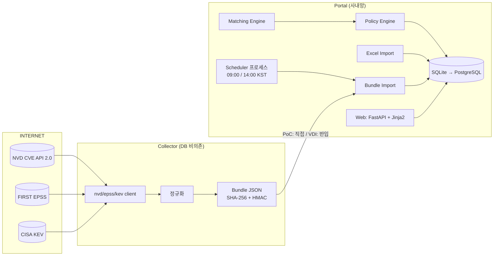

# IT자산 취약점 관리 포털 (PoC)

외부 공개 취약점 데이터(NVD / FIRST EPSS / CISA KEV)를 수집하고 Excel 자산관리대장과 매핑하여,
회사 정책에 따라 **취약 자산 식별 → 등급(긴급/우선/주의) → 조치기한 → 담당자 → 상태 관리**를 자동화하는 사내망용 포털의 PoC입니다.

| 문서 | 내용 |
|---|---|
| [`docs/00_design.md`](docs/00_design.md) | 요구사항 분석, 위험요소, Architecture, DB Schema, 매칭 알고리즘 설계, 사용자 결정사항 |
| [`docs/external_communications.md`](docs/external_communications.md) | 외부 통신 목록 (방화벽 신청용) |
| [`docs/security_review.md`](docs/security_review.md) | Secure Coding 검토 결과, Checklist, 필수 테스트 대응표 |
| [`docs/vdi_migration.md`](docs/vdi_migration.md) | 인터넷 차단 VDI 이전 가이드 |
| [`docs/completion_checklist.md`](docs/completion_checklist.md) | 1차 PoC 완료 조건 18개 점검표 |

---

## 1. 시스템 목적

```
외부 취약점 수집 → CVE/CVSS/EPSS/CPE 정규화 → 자산관리대장(.xlsx) 업로드 → 제품·버전 식별
→ 취약점↔자산 매핑 → 회사 정책 적용 → 등급 결정 → 조치기한 계산 → 담당자 지정 → Dashboard
```

- 매핑이 불확실하면 자동으로 "취약" 판정하지 않습니다 (False Positive 최소화 → 사람 검토).
- 원본 데이터(CVSS·EPSS·CPE·KEV)와 시스템 계산값(등급·기한·Confidence·상태)을 구분 저장합니다.
- 모든 판정·승인·상태 변경은 감사 추적이 가능합니다 (정책 변경 시에도 과거 판정 보존).

## 2. Architecture



| 계층 | 위치 |
|---|---|
| Web (Router·Template) | `app/web/`, `app/templates/`, `app/static/` |
| 업무 로직 | `app/services/` — `nvd_client`, `epss_client`, `kev_client`, `collector`, `bundle*`, `vulnerability_collector`, `asset_importer`, `matching_engine`, `version_compare`, `policy_engine`, `mapping_service`, `exporter`, `audit` |
| 저장소 | `app/repositories/`, `app/models/` (SQLAlchemy), `migrations/` (Alembic) |
| 보안 | `app/security/` — 인증(AuthProvider), 비밀번호, 업로드 검증, 입력 검증, 로그 마스킹 |
| 설정 | `app/config/` (환경변수·Endpoint Allowlist), `config/policy.yaml`, `config/product_aliases.yaml` |
| Scheduler | `app/scheduler/` (웹과 별도 프로세스) |
| 스크립트 | `scripts/` |

## 3. 개발환경 구성 (Windows)

### 3.1 Python 설치
- Python **3.12 이상** 설치: https://www.python.org/downloads/ — 설치 첫 화면에서 **"Add python.exe to PATH" 체크**
- (선택) Git 설치: https://git-scm.com/download/win
- 확인 (CMD): `py -3.12 --version`

### 3.2 소스 받기 · Virtual Environment 구성

```cmd
cd %USERPROFILE%\Documents
git clone -b claude/vulnerability-management-poc-qthd3d https://github.com/fionaeunji/AssetVulPortal.git
cd AssetVulPortal
py -3.12 -m venv .venv
.venv\Scripts\activate.bat
```
CMD를 새로 열 때마다 프로젝트 폴더에서 `.venv\Scripts\activate.bat` 를 실행합니다 (PowerShell은 `.\.venv\Scripts\Activate.ps1`).

### 3.3 Dependency 설치

```cmd
pip install -r requirements-dev.txt
```

| 패키지 | 사용 이유 |
|---|---|
| fastapi, uvicorn | Web 서버/라우팅 |
| SQLAlchemy, alembic | ORM(SQL Injection 방지, PostgreSQL 전환), 스키마 Migration |
| pydantic, pydantic-settings | 외부 응답·입력·정책 파일 검증, `.env` 설정 로딩 |
| httpx | 외부 API 호출 (타임아웃, Redirect 제어, 스트리밍 크기 제한) |
| truststore | OS(Windows) 인증서 저장소로 TLS 검증 — 회사 SSL 검사 환경 대응 |
| openpyxl, defusedxml | Excel 읽기/쓰기, XML 공격(XXE/Entity bomb) 방어 |
| APScheduler | 09:00/14:00 Asia/Seoul 자동 수집 |
| Jinja2 | 서버 렌더링 (autoescape) |
| python-multipart | 파일 업로드/폼 처리 |
| itsdangerous | 서명 세션 쿠키 |
| PyYAML | 정책·별칭 파일 (`safe_load`만 사용) |
| tzdata | Windows에서 `Asia/Seoul` 시간대 데이터 |
| pytest, bandit, pip-audit (dev) | 테스트, 정적 분석, 의존성 취약점 조회 |

### 3.4 환경변수 (`.env`)

```cmd
python -c "import secrets; print('APP_SECRET_KEY=' + secrets.token_urlsafe(48))" > .env
```
다른 설정은 기본값으로 동작합니다. 전체 항목은 [`.env.example`](.env.example) 참고 (`NVD_API_KEY`, `COLLECTOR_MODE`, `BUNDLE_HMAC_KEY`, `TLS_TRUST_STORE`, `UPLOAD_MAX_BYTES` 등). `.env` 는 Git에 포함되지 않습니다.

## 4. DB 초기화

```cmd
python -m scripts.init_db
python -m scripts.create_user --username admin --role admin
```
- Alembic Migration으로 테이블과 무결성 Trigger(감사로그·판정이력 Append-only, Initial EPSS·최초 조치기한 불변)를 생성합니다. 코드 업데이트(`git pull`) 후에도 한 번 실행하세요.
- 역할: `viewer`(조회) / `operator`(업로드·상태변경·매핑승인·수집) / `admin`(감사로그·정책). 비밀번호는 10자 이상, 대·소문자·숫자·기호 중 3종 이상.

## 5. 실행방법

```cmd
python -m uvicorn app.main:app --host 127.0.0.1 --port 8000
```
브라우저에서 **http://127.0.0.1:8000** → 로그인. 종료는 `Ctrl+C`.
`python -m` 형태로 실행하면 PATH 설정과 무관하게 동작합니다. (가상환경을 쓰는 경우 먼저 `.venv\Scripts\activate.bat`)

| 메뉴 | 기능 |
|---|---|
| Dashboard | KPI(전체/취약 자산, 긴급·우선·주의, EPSS 대기, 기한 초과), 취약점 목록(등급·CVE·자산명·IP·제품·Version·CVSS·Initial/Current EPSS·KEV·자산구분·중요도·담당자·탐지일·조치기한·남은시간·상태), 검색(CVE/IP/Hostname/제품/담당자), 필터(등급/KEV/경계면·내부/기한초과/담당자/상태), **Excel 다운로드** |
| 취약점 상세 | SOURCE DATA(CVSS·Vector·EPSS·KEV) / CALCULATED DATA(등급·기한·남은시간·매핑방식·**매핑근거**), 상태 변경, 담당자 지정, 상태·판정 이력 |
| 자산 | 자산 목록/상세, 자산관리대장 업로드 |
| 매핑 검토 | Level 2 후보(Confidence·산정근거) / Level 3 검토 → [매핑 승인] [매핑 제외] |
| 수집 | **[지금 취약점 정보 수집]**, 수집 이력(외부 목적지·오류) |
| 감사로그 · 정책 (admin) | 감사로그 조회·무결성 검증, 정책 버전 적용 |

## 6. 샘플 Excel 업로드 방법

- 샘플: [`sample_data/sample_assets.xlsx`](sample_data/sample_assets.xlsx) — 가상 자산 23개/제품 24개. IP는 문서용 예약 대역(RFC 5737), 담당자·부서는 가상 명칭. `비고` 열에 매칭 기대값(취약/범위 제외/CPE 없음/잘못된 CPE/검토 필요)을 적어 두었습니다. 재생성: `python -m scripts.generate_sample_assets`
- 웹: **자산 → 자산관리대장 업로드** → 파일 선택 → 업로드 (operator 이상)
- CLI: `python -m scripts.import_assets sample_data\sample_assets.xlsx`
- 필수 컬럼: `Asset ID, 자산명, 자산구분(경계면/내부), IP, Vendor, Product, Version, CPE, 중요도(상/중/하), 담당자, 부서`
- 같은 Asset ID를 여러 행에 쓰면 한 자산의 여러 제품(OS+애플리케이션)으로 등록됩니다.
- 오류 행이 하나라도 있으면 파일 전체를 반영하지 않고 행·열별 오류를 보여줍니다. 잘못된 CPE는 경고(후보 매칭 대상)입니다.
- 재업로드 시 빠진 자산·제품은 삭제하지 않고 비활성화, 버전 변경 시 기존 매핑은 `재검증 필요`로 표시합니다.

## 7. 수동 취약점 수집 방법

- 웹: **수집 → [지금 취약점 정보 수집]** (operator 이상, 백그라운드 실행, 이력 화면에서 결과 확인)
- CLI: `python -m scripts.collect` (특정 제품 추가: `--product a:apache:http_server`, 전체 재수집: `--full`)
- 수집 후 매핑·판정이 자동 실행됩니다. 결과 확인: `python -m scripts.run_matching`

| Source | 방식 |
|---|---|
| NVD | 자산 CPE의 제품(`part:vendor:product`) 단위 `virtualMatchString` 조회. 첫 수집은 전체 이력, 이후 `lastModStartDate/EndDate` 증분(120일 단위 분할). API Key 없으면 요청 간 6초 |
| EPSS | 보유 CVE < 1,000건이면 API(100건 단위), 이상이면 Bulk CSV — CSV 실패 시 API로 자동 대체 |
| KEV | CISA 카탈로그 JSON (화면 표시용, 등급 판정 미반영) |

- **Initial EPSS** = 시스템이 해당 CVE의 EPSS를 최초로 관측한 값(이후 변경 불가, DB Trigger). **Current EPSS** = 최신 값(더 최신 score date일 때만 갱신), 날짜별 이력은 `epss_history`.
- 중복 실행 방지(DB Lock), 수집 중 오류가 나도 기존 데이터는 삭제·초기화되지 않습니다(단일 트랜잭션). 동일 CVE 재수집 시 중복 레코드가 생기지 않습니다.
- 회사 SSL 검사 환경: Windows 인증서 저장소 사용(기본). 별도 CA는 `SSL_CERT_FILE`, Proxy는 `HTTPS_PROXY`.

## 8. Scheduler 설명

웹 서버와 **별도 CMD 창**에서 실행합니다.

```cmd
python -m app.scheduler --next        & rem 다음 실행 예정 시각
python -m app.scheduler               & rem 상주: 매일 09:00, 14:00 (Asia/Seoul)
python -m app.scheduler --run-once    & rem 지금 1회 실행
```
- PC 시간대와 무관하게 Asia/Seoul 기준, 웹 수동 수집과 DB Lock 공유(겹치면 건너뜀), 오류가 나도 스케줄러는 계속 동작
- offline(VDI) 모드: 외부 통신 없이 `data\bundles\inbox\*.json` 을 검증 후 Import (`processed\` / `failed\`)
- Windows 작업 스케줄러로 대체 시 `python -m app.scheduler --run-once` 를 09:00/14:00에 등록

## 9. 정책 설정방법 (`config/policy.yaml`)

```yaml
version: "2026.09-02"                  # 변경 시 반드시 값 변경
cvss:  { source_priority: ["3.1:Primary", "3.1:Secondary", "4.0:Primary", "4.0:Secondary", "3.0:Primary", "3.0:Secondary"] }
epss:  { missing_behavior: pending }   # EPSS 미발행 → 판정보류, 최초 EPSS 관측 시 재판정
deadline: { month_mode: fixed_days, days_per_month: 30 }
matching: { review_all_versions_parts: ["o"] }   # NVD '모든 버전' 등록 CVE 중 OS 는 자동 확정 대신 검토(L3)
rules:                                 # 위에서부터 순서대로 평가 (긴급 → 우선 → 주의)
  - {key: emergency, name: "긴급", cvss_min: 9.0, epss_initial_min: 0.30, deadline: {perimeter: {hours: 72}, internal: {months: 1.5}}}
  - {key: priority,  name: "우선", cvss_min: 9.0, epss_initial_min: 0.10, deadline: {perimeter: {days: 14},  internal: {months: 1.5}}}
  - {key: caution,   name: "주의", cvss_min: 7.0,                          deadline: {perimeter: {months: 1}, internal: {months: 3}}}
```

- 정책 값은 코드에 없습니다. 파일 수정 → `version` 변경 → 관리자 **정책 → [새 정책 버전으로 적용]** → 전체 재판정. 과거 판정은 정책 버전과 함께 `vulnerability_assessments` 에 보존, 최초 조치기한은 변경되지 않습니다.
- CVSS ≥ 9.0 이지만 Initial EPSS < 0.1 이면 "주의"로 분류됩니다(규칙 순서).
- `matching.review_all_versions_parts`: NVD가 버전 범위 없이 "모든 버전"으로 등록한 CVE(예: CVE-2022-26937 → `windows_server_2022:*`)는 패치된 빌드도 매칭되므로, 지정한 제품군(기본 OS `o`)은 자동 확정하지 않고 **검토 필요(L3)** 로 보냅니다. 이미 확정된 건은 삭제하지 않고 `재검증 필요`로 표시합니다.
- 새 정책 버전(`2026.09-02`)은 관리자 **정책 → [적용]** 시 활성화됩니다. 이 항목은 기존 정책(`2026.09-01`)에서도 기본값(OS 검토)으로 동작합니다.

**현재 적용한 조치기한 계산 방법**
- 기산점: 시스템이 해당 자산-CVE 매핑을 최초 확정한 시각(탐지일, DB는 UTC / 화면·Excel은 KST)
- `fixed_days` + `days_per_month: 30` → **1개월 = 30일, 1.5개월 = 45일, 3개월 = 90일**, 72시간·14일은 그대로 가산
- 대안 `month_mode: calendar`: 정수 개월은 달력 기준(말일 보정, 1/31 + 1개월 = 2/28) + 소수부 × 30일

**매칭 규칙 요약** — Level 1(CPE 있음): NVD 구성을 참/거짓/판단불가로 평가(`versionStart/End Including/Excluding`, update·플랫폼 조건 포함) → 참만 자동 확정, 판단불가는 Level 3 검토. Level 2(CPE 없음/오류): 별칭 사전(`config/product_aliases.yaml`)·수집 CPE 사전으로 후보 제시, 승인 전 확정 안 함, 승인 매핑은 재사용.
Match Confidence(Level 2) = 규칙 합산: Vendor 일치 30 / 별칭 20, Product 일치 40 / 별칭 25 / 토큰 겹침 10, 버전 비교 가능 20, 별칭 사전 등록 10 (50점 이상 상위 3개).

## 10. 외부 통신 목록

| Source Component | Destination FQDN | Port | Protocol | Purpose | Direction | Frequency | Required / Optional |
|---|---|---|---|---|---|---|---|
| nvd_client | services.nvd.nist.gov | 443 | HTTPS | CVE·CVSS·CPE 수집 | Outbound | 1일 2회 + 수동 | Required |
| epss_client | api.first.org | 443 | HTTPS | EPSS 조회 | Outbound | 1일 2회 + 수동 | Required (CSV와 택1) |
| epss_client | epss.empiricalsecurity.com | 443 | HTTPS | EPSS Bulk CSV | Outbound | 1일 2회 + 수동 | Optional |
| kev_client | www.cisa.gov | 443 | HTTPS | CISA KEV 카탈로그 | Outbound | 1일 2회 + 수동 | Optional |

웹 화면은 외부 통신이 없습니다(CDN 미사용). 상세·비고·설치 단계 통신: [`docs/external_communications.md`](docs/external_communications.md). 실제 호출 기록으로 재생성: `python -m scripts.report_endpoints`

## 11. Secure Coding 적용내역

| 분류 | 적용 |
|---|---|
| File Upload | `.xlsx` allowlist + ZIP 서명 + OOXML 구조 검증(매크로·VBA·ActiveX·외부연결·포함개체 거부), Zip bomb·내부 경로 조작 검사, 크기 제한, 수식 셀 거부, UUID 파일명으로 Web root 밖 저장 |
| Input Validation | Server side allowlist(Enum), IP(`ipaddress`), CVE ID 정규식, CVSS 0–10 / EPSS 0–1(+DB CHECK), 길이·제어문자 제한 |
| SQL Injection | ORM·바인드 파라미터만 사용, LIKE 검색 이스케이프 |
| XSS | Jinja2 autoescape, `\|safe`·인라인 스크립트/스타일 미사용, CSP `script-src 'self'` |
| CSRF | 모든 POST(로그인 포함) Synchronizer Token + `SameSite=Strict` |
| SSRF | Endpoint Allowlist 상수만 사용, 요청 직전 Host 재검증, Allowlist 대상 Redirect만 최대 3회 |
| Secrets | `.env`(gitignore)·`.env.example`, `SecretStr`, 로그 마스킹, API Key는 헤더로만 |
| Authentication | `AuthProvider` 분리(사내 SSO 교체 가능), scrypt, 계정 5회 실패 잠금, IP별 실패 제한, 세션 유휴 만료·로그인 시 재생성, RBAC(viewer/operator/admin) 매 요청 DB 확인 |
| Error Handling | 사용자에게 오류 ID만, 상세는 서버 로그(`data\logs\app.log`) |
| Audit Log | 로그인·업로드·자산/담당자 변경·매핑 승인/거부·상태 변경·정책 변경·수집·Export 기록, ORM+DB Trigger로 수정·삭제 차단, SHA-256 Hash chain |
| Export | Formula Injection 방어(`= + - @`·탭/CR/LF·전각 → `'` 접두 + 문자열 타입) |
| 외부 데이터 | 스키마 검증, 응답 크기 제한, TLS 검증 유지(OS 인증서 저장소) |

상세: [`docs/security_review.md`](docs/security_review.md)

## 12. 테스트 실행방법

```cmd
python -m pytest                     & rem 전체 (368건, 네트워크 불필요 — 녹화 Fixture 사용)
python -m pytest tests\security      & rem 보안 테스트만
bandit -r app scripts                & rem 정적 분석
pip-audit -r requirements.txt        & rem 의존성 취약점 (인터넷 필요)
```

테스트 Fixture 출처: `tests/fixtures/README.md` (NVD 레코드는 공개 미러의 실제 데이터, KEV는 CISA 공식 GitHub 발췌, EPSS 값은 합성).

## 13. VDI 환경 이전 시 고려사항

- Portal은 인터넷 없이 동작하도록 설계: `COLLECTOR_MODE=offline` → 외부 수집 비활성, Bundle Import만 허용
- 외부망 Collector PC에서 `targets.json` → 수집 → `bundle_*.json`(SHA-256 + `BUNDLE_HMAC_KEY` HMAC) → 보안 반입 → `data\bundles\inbox` → Scheduler가 검증 후 Import
- 반출 파일에는 자산명·IP·담당자가 포함되지 않음(제품 키·CVE ID만)
- 패키지는 인터넷 PC에서 `pip download` 후 `pip install --no-index --find-links wheels` 로 설치
- 운영: HTTPS 리버스 프록시 + `APP_ENV=prod`, 사내 SSO 연동, PostgreSQL 전환(미검증 — 전환 시 테스트), NTP, 백업, `pip-audit`

절차 상세: [`docs/vdi_migration.md`](docs/vdi_migration.md)

## 14. 알려진 제한 (PoC)

- NVD 미분석(Awaiting Analysis) CVE는 CPE 구성이 없어 자동 매칭되지 않습니다(NVD 데이터 한계).
- OS 제품(Ubuntu, Windows Server 등)은 NVD 데이터상 CVE 수가 많아 매핑 건수가 많을 수 있습니다.
- 버전 비교 규칙은 일반 규칙 + 별칭 사전의 벤더 규칙으로 동작하며, 확신이 없으면 비교 불가(검토 필요)로 처리합니다.
- 로그인 IP 제한은 프로세스 메모리 기반(단일 인스턴스 전제)입니다.
