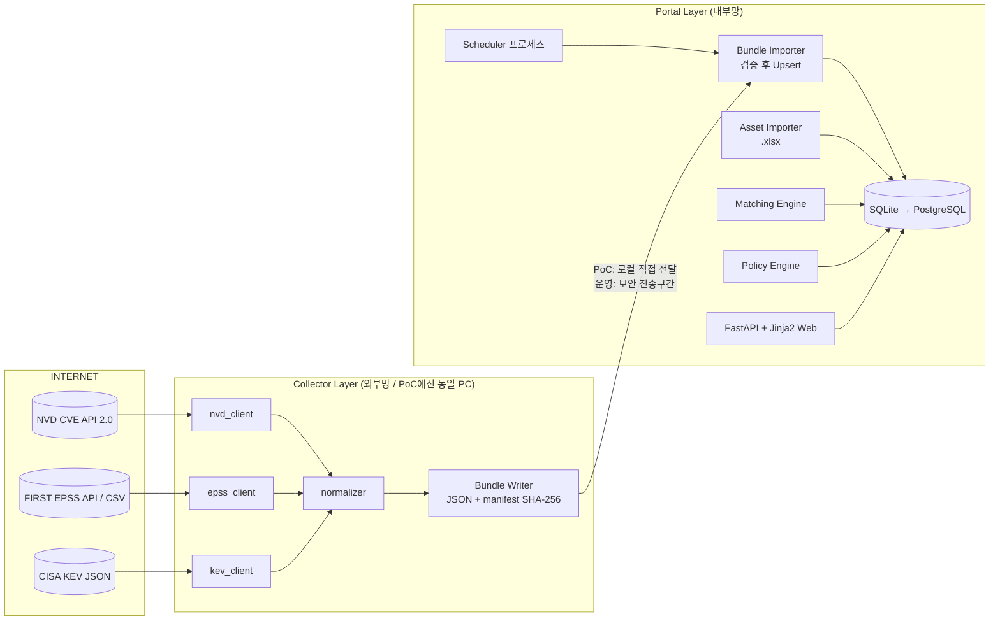
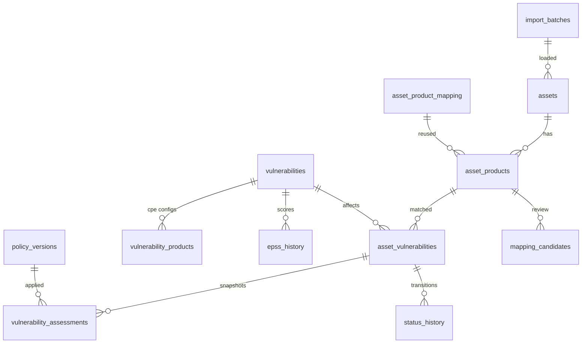
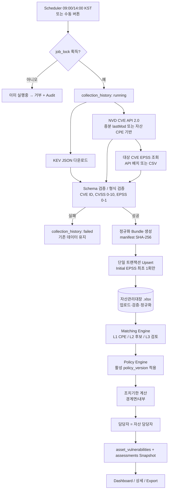

# IT자산 취약점 관리 포털 PoC — 설계서 (Phase 0)

- 문서 상태: **확정 (2026-09-28 사용자 결정 반영, §13)**
- 작성일: 2026-09-28
- 범위: 요구사항 분석, 위험요소, Architecture, DB Schema, 데이터 흐름, 외부 연동, Matching 알고리즘, Secure Coding Checklist, Phase 계획

---

## 1. 요구사항 분석 요약

| 영역 | 핵심 요구 | 설계 반영 |
|---|---|---|
| 수집 | NVD API 2.0, FIRST EPSS, CISA KEV (공식 API/Feed만) | `collector` 패키지를 Portal과 분리, Endpoint는 설정 Allowlist |
| 정규화 | CVE/CVSS/EPSS/CPE, Initial EPSS 불변 | Source 원본 필드와 계산 필드 분리 저장 |
| 자산 | `.xlsx` 업로드, 최소 11개 컬럼, 경계면/내부 | 업로드 보안검증 → Staging → 검증 → 반영 |
| 매칭 | CPE Level1 확정, Level2 후보, Level3 검토 | 불확실 = 자동 "취약" 금지 (False Positive 최소화) |
| 정책 | 긴급→우선→주의 순서, 코드 하드코딩 금지 | YAML → DB `policy_versions`(불변 버전) |
| 기한 | 경계면/내부별 기한, 1.5개월 모호 | 계산방식을 설정값으로 분리 (사용자 결정 필요) |
| 감사 | 누가/언제/왜/어떤 정책으로 | 판정 Snapshot + Append-only Audit Log(Hash chain) |
| 운영 | 인터넷 차단 VDI | Collector → 검증 Bundle(JSON) → Portal Import 구조 |

---

## 2. 모호하거나 구현상 위험한 요구사항

| # | 항목 | 위험 | 제안 기본값 |
|---|---|---|---|
| R1 | **"1.5개월" 계산** | 달력월(1개월+15일) / 45일 고정 / 1.5×30일 결과가 다름. 2월 등에서 최대 3일 차이 | 설정값 `month_mode`로 분리. **사용자 결정 필요 (Q1)** |
| R2 | **EPSS 미발행 CVE** | 신규 CVE는 EPSS가 없을 수 있음. CVSS 9.8 + EPSS 없음 → 규칙상 "주의"로 떨어지고, 이후 EPSS가 나와도 Initial EPSS 정의상 최초 관측값이 적용됨 | EPSS 없음을 0으로 간주하지 않음. **사용자 결정 필요 (Q2)** |
| R3 | **Initial EPSS 정의** | "시스템 최초 관측"이므로 시스템 도입 시점에 오래된 CVE는 현재 값이 Initial이 됨 (공개 시점 값 아님) | 요구사항 그대로 구현, 화면·README에 정의 명시. `epss_score_date`(FIRST 기준일)를 함께 저장 |
| R4 | **CVSS 버전/출처** | NVD는 v4.0, v3.1, v3.0, v2 및 Primary(NVD)/Secondary(CNA) 점수가 혼재. 어떤 점수를 쓰느냐에 따라 등급이 바뀜 | 우선순위를 정책파일에서 설정. **사용자 결정 필요 (Q3)** |
| R5 | **NVD 미분석(Awaiting Analysis) CVE** | 2024년 이후 NVD 백로그로 `configurations`(CPE)가 없는 CVE가 다수 존재 → CPE 매칭 불가 | CPE 없는 CVE는 Level 2 후보(검토필요)로만 처리, 자동 확정 금지 |
| R6 | **수집 범위** | NVD 전체(수십만 건) 초기 적재는 Rate Limit(키 없음 5req/30s) 때문에 수 시간 소요 | 자산 기반 수집 + 증분 동기화. **사용자 결정 필요 (Q4)** |
| R7 | **정책 변경 / CVSS 변경 시 재판정** | 정책이나 NVD CVSS가 바뀌면 등급·기한이 바뀌어 과거 판정이 사라질 위험 | 판정은 `vulnerability_assessments`에 **Append-only Snapshot**. 최초 조치기한(`initial_due_at`)은 불변, 재판정 시 새 Snapshot 추가 |
| R8 | **벤더별 버전 형식** | `8u401`, `15.2(4)M`, `7.2.5 build1517`, `10.0.20348` 등 일반 비교기로 오판 가능 | 벤더별 정규화 규칙 + 파싱 불가/모호 시 "검토 필요" |
| R9 | **CPE AND 구성(running on/with)** | 예: FortiOS 취약 + 특정 하드웨어 조건. 플랫폼 정보가 없으면 판단 불가 | 비취약 플랫폼 노드 미충족·불명 시 "검토 필요" |
| R10 | **조치완료 후 재탐지 / 자산 버전 변경** | 재업로드로 버전이 올라가면 기존 매핑이 무효가 될 수 있음 | 자동 종결하지 않고 `재검증 필요` 플래그 + Audit |
| R11 | **이 개발 컨테이너의 네트워크 제한** | 현재 클라우드 개발환경에서 `services.nvd.nist.gov`, `api.first.org`, `epss.empiricalsecurity.com`, `www.cisa.gov`가 egress 정책으로 차단됨 (GitHub raw는 허용) | 컨테이너에서는 **녹화된 Fixture**로 테스트, 실제 수집은 사용자 Windows PC에서 검증. 환경 설정에서 도메인 허용 시 컨테이너에서도 실수집 가능 |
| R12 | **Windows 시간대 DB** | Windows Python의 `zoneinfo`는 IANA DB가 없어 `Asia/Seoul` 로딩 실패 | `tzdata` 패키지 의존성 추가 |
| R13 | **openpyxl XML 파싱** | XML Bomb/XXE 위험 | `defusedxml` 설치 시 openpyxl이 자동 사용 + Zip Bomb 사전검사 |
| R14 | **Confidence 점수** | 근거 없는 숫자 금지 요구 | 규칙 기반 가산점(아래 §7.5) + 화면에 산정 근거 Breakdown 표시 |

---

## 3. Architecture

### 3.1 논리 구조



- **PoC 모드 (`COLLECTOR_MODE=online`)**: Portal이 Collector를 in-process 호출 → Bundle 생성 → 즉시 Import.
- **VDI 모드 (`COLLECTOR_MODE=offline`)**: Portal은 외부 통신 코드를 호출하지 않음. 관리자가 Bundle 파일을 업로드/지정 폴더에서 Import.
- Portal의 Import 경로는 두 모드에서 **동일**하므로, 온라인에서 검증된 로직이 VDI에서도 그대로 동작.

### 3.2 계층 구조

```
api (Router, 입력검증) → services (업무로직) → repositories (ORM 접근) → models (SQLAlchemy)
                           ↑
security (인증/인가/CSRF/업로드검증/Export 방어)
```

- Router에는 SQL/업무로직 없음. Repository만 Session 사용.
- Collector는 `app.collector` 패키지로 독립: Portal의 Web/DB 코드에 의존하지 않음(정규화 Schema만 공유).

### 3.3 프로세스 구성

| 프로세스 | 명령 | 역할 |
|---|---|---|
| Web | `uvicorn app.main:app --host 127.0.0.1` | 화면/API, 수동수집 버튼 |
| Scheduler | `python -m app.scheduler` | 09:00/14:00 Asia/Seoul 수집 |
| CLI | `python -m scripts.collect --out bundle/` / `--import bundle/` | VDI 분리 운영용 |

중복 실행 방지는 **DB 기반 Lease Lock**(`job_locks` 테이블, 만료시간 포함)으로 프로세스 간 공통 적용.

---

## 4. DB Schema

시간값은 전부 **UTC(tz-aware)** 저장, 화면에서 Asia/Seoul 변환. SQLite는 tz 정보를 잃으므로 `UTCDateTime` TypeDecorator 사용.

### 4.1 필수 Entity

| 테이블 | 주요 컬럼 | 비고 |
|---|---|---|
| **assets** | id, asset_code(UK, "Asset ID"), name, hostname, zone(`경계면`/`내부`), ip, criticality(`상`/`중`/`하`), owner_name, department, is_active, import_batch_id, created_at, updated_at | 자산 1건 |
| **asset_products** | id, asset_id(FK), vendor_raw, product_raw, version_raw, cpe_raw, cpe_normalized, vendor_norm, product_norm, version_norm, update_norm, source(`excel`/`mapping`) | 자산이 가진 SW/OS. 1자산 N제품 가능(OS + 앱) |
| **vulnerabilities** | cve_id(PK), description, published_at, last_modified_at, vuln_status(NVD), cvss_version, cvss_score, cvss_vector, cvss_source, cvss_type(Primary/Secondary), kev(bool), kev_date_added, kev_due_date, kev_ransomware, epss_initial, epss_initial_date, epss_first_seen_at, epss_current, epss_current_percentile, epss_current_date, epss_last_updated_at, raw_hash, first_collected_at, last_collected_at | **SOURCE DATA**. `epss_initial*`은 최초 1회만 기록(갱신 금지, Repository 레벨 + 테스트로 보장) |
| **epss_history** | id, cve_id, epss, percentile, score_date, collected_at, collection_id | (cve_id, score_date) UK → 중복 방지 |
| **vulnerability_products** | id, cve_id, config_index, node_index, node_operator, node_negate, config_operator, vulnerable, criteria(CPE 2.3), match_criteria_id, part, vendor, product, version, update, target_sw, target_hw, version_start_including, version_start_excluding, version_end_including, version_end_excluding | NVD `configurations` 평탄화. 재수집 시 CVE 단위 교체(트랜잭션) |
| **asset_product_mapping** | id, vendor_norm, product_norm, version_pattern, cpe_vendor, cpe_product, status(`approved`/`rejected`), approved_by, approved_at, reason | 사용자가 승인한 제품→CPE 매핑 **재사용 사전** |
| **asset_vulnerabilities** | id, asset_id, asset_product_id, cve_id, severity, detected_at, **initial_due_at**(불변), due_at, owner, status, match_type(`CPE_EXACT`/`CPE_RANGE`/`APPROVED_MAPPING`/`CANDIDATE`), match_confidence, match_evidence(JSON), policy_version_id, current_assessment_id, needs_revalidation, created_at, updated_at | (asset_product_id, cve_id) UK |
| **collection_history** | id, source(`NVD`/`EPSS`/`KEV`/`BUNDLE`), trigger(`schedule`/`manual`/`import`), requested_by, started_at, finished_at, status(`running`/`success`/`partial`/`failed`), params(JSON), items_fetched, items_inserted, items_updated, error_summary, bundle_sha256 | 수집 증적 |
| **audit_logs** | id, occurred_at, actor, actor_role, action, target_type, target_id, before(JSON), after(JSON), client_ip, result, prev_hash, hash | **Append-only** + Hash Chain |

### 4.2 추가 Entity (감사추적·보안 요구 충족용)

| 테이블 | 목적 |
|---|---|
| **users** | username, password_hash(scrypt, 표준라이브러리), role(`viewer`/`operator`/`admin`), is_active, failed_login_count, locked_until |
| **policy_versions** | id, version(UK), name, content_yaml, content_sha256, effective_from, created_by, is_active — 정책 **불변 버전**. 수정 = 새 버전 추가 |
| **vulnerability_assessments** | 판정 Snapshot (Append-only): asset_vulnerability_id, policy_version_id, cvss_score_used, cvss_version_used, epss_initial_used, severity, zone, due_at_computed, calc_method, assessed_at, reason |
| **status_history** | asset_vulnerability_id, from_status, to_status, changed_by, changed_at, comment |
| **mapping_candidates** | Level 2/3 검토대기 항목: asset_product_id, cve_id 또는 제안 CPE, confidence, breakdown(JSON), status(`pending`/`approved`/`rejected`), decided_by, decided_at |
| **import_batches** | Excel 업로드 이력: stored_file_id(UUID), original_filename(표시용·정제), sha256, size, row_count, error_count, uploaded_by, uploaded_at |
| **job_locks** | name(PK), holder, acquired_at, expires_at — 중복 실행 방지 |

### 4.3 ER 개요



### 4.4 Audit Log 불변성

1. 애플리케이션 코드: `AuditLog`에 대한 UPDATE/DELETE를 SQLAlchemy `before_flush` 이벤트에서 차단.
2. DB: SQLite `BEFORE UPDATE/DELETE` Trigger로 `RAISE(ABORT)` (Alembic Migration). PostgreSQL 전환 시 `REVOKE UPDATE, DELETE` + Trigger.
3. 위변조 탐지: `hash = SHA256(prev_hash || canonical_json(row))`. 관리자 화면에 Chain 검증 기능.
4. 조회는 Administrator만, 삭제/수정 UI·API 없음.

---

## 5. 데이터 흐름



---

## 6. 외부 데이터 Source 연동방식

> 확인 상태: 현재 개발 컨테이너에서 NVD·FIRST·CISA 도메인이 차단되어 공식 문서 페이지를 직접 열람하지 못했습니다. 아래 NVD/EPSS 항목은 검색 결과로 확인한 내용이며, **Phase 2 착수 전 공식 문서로 재확인**합니다. KEV는 CISA 공식 GitHub 저장소(`cisagov/kev-data`)의 실제 JSON을 받아 필드명을 확인했습니다(카탈로그 버전 2026.09.27).

### 6.1 NVD CVE API 2.0

| 항목 | 내용 | 확인 |
|---|---|---|
| Endpoint | `https://services.nvd.nist.gov/rest/json/cves/2.0` | 검색결과 확인 |
| 인증 | 선택: 요청 Header `apiKey` (환경변수 `NVD_API_KEY`) | Phase 2에서 공식문서 재확인 |
| Rate Limit | 키 없음 5 req/30s, 키 있음 50 req/30s | 검색결과 확인 |
| 페이지 | `resultsPerPage` 최대 2,000, `startIndex` | 검색결과 확인 |
| 증분 | `lastModStartDate`+`lastModEndDate` 둘 다 필수, 최대 120일 구간 | 검색결과 확인 |
| 자산기반 | `cpeName`(정확 CPE) / `virtualMatchString`(부분 CPE) | Phase 2에서 확인 |
| 추출필드 | `cve.id`, `descriptions[lang=en]`, `published`, `lastModified`, `vulnStatus`, `metrics.cvssMetricV31/V30/V40[].cvssData.baseScore/vectorString`, `type`(Primary/Secondary), `configurations[].nodes[].cpeMatch[]`(`vulnerable`, `criteria`, `matchCriteriaId`, `versionStart/End Including/Excluding`) | Phase 2에서 실응답으로 검증 |

구현 원칙
- 요청 간 Rate Limit 준수(Token bucket), 429/503 시 지수 Backoff, 타임아웃 30s.
- 응답은 Pydantic 모델로 검증. 알 수 없는 구조는 해당 CVE만 Skip + 경고 기록.
- 동기화 커서(`last_successful_lastmod_end`)는 **전체 성공 시에만** 전진.

### 6.2 FIRST EPSS

| 항목 | 내용 |
|---|---|
| API | `https://api.first.org/data/v1/epss?cve=CVE-A,CVE-B,...` (배치) |
| Bulk CSV | `https://epss.empiricalsecurity.com/epss_scores-current.csv.gz` (첫 줄 주석에 model version/score_date, 컬럼 `cve,epss,percentile`) |
| 인증 | 없음 |
| 전략 | 대상 CVE가 적으면 API 배치(요청당 CVE 수는 URL 길이 제한 고려해 100개 단위), 대량 동기화는 CSV 1일 1회 |
| 저장 | `epss_initial`은 NULL일 때만 기록. `epss_current`는 score_date가 더 최신일 때만 갱신. `epss_history`는 (cve, score_date) Upsert |

※ Bulk CSV 호스트는 과거 `epss.cyentia.com`에서 변경된 것으로 검색됨. Phase 2에서 FIRST 공식 페이지 링크로 재확인하고 설정값으로 관리(하드코딩 금지).

### 6.3 CISA KEV

| 항목 | 내용 | 확인 |
|---|---|---|
| Endpoint | `https://www.cisa.gov/sites/default/files/feeds/known_exploited_vulnerabilities.json` | Phase 2에서 확인 |
| 공식 Mirror | `https://raw.githubusercontent.com/cisagov/kev-data/main/known_exploited_vulnerabilities.json` | **실제 다운로드 확인** |
| Top-level | `title`, `catalogVersion`, `dateReleased`, `count`, `vulnerabilities[]` | 확인 |
| 항목 필드 | `cveID`, `vendorProject`, `product`, `vulnerabilityName`, `dateAdded`, `shortDescription`, `requiredAction`, `dueDate`, `knownRansomwareCampaignUse`, `notes`, `cwes` (+ 최신 버전에서 `forensicTriage` 확인) | 확인 |
| 사용 | 화면 표시·필터 전용. **등급 판정에는 반영하지 않음** | — |

### 6.4 외부 통신 (예비 목록, Phase 10에서 실측 확정)

| Source Component | Destination FQDN | Port | Protocol | Purpose | Direction | Frequency | Required |
|---|---|---|---|---|---|---|---|
| nvd_client | services.nvd.nist.gov | 443 | HTTPS | CVE/CVSS/CPE 수집 | Outbound | 1일 2회 + 수동 | Required |
| epss_client | api.first.org | 443 | HTTPS | EPSS 배치 조회 | Outbound | 1일 2회 + 수동 | Required(택1) |
| epss_client | epss.empiricalsecurity.com | 443 | HTTPS | EPSS Bulk CSV | Outbound | 1일 1회 | Optional(택1) |
| kev_client | www.cisa.gov | 443 | HTTPS | KEV 카탈로그 | Outbound | 1일 2회 + 수동 | Optional |

- Web UI는 CDN을 쓰지 않음(CSS/JS 로컬 제공) → 브라우저 외부 통신 0건.
- 모든 요청은 `httpx` 이벤트 훅으로 목적지를 `collection_history`/로그에 기록하여 실측 목록을 자동 생성.

---

## 7. CPE / Version Range Matching 알고리즘

### 7.1 CPE 2.3 파싱

- 형식: `cpe:2.3:part:vendor:product:version:update:edition:language:sw_edition:target_sw:target_hw:other` (13 필드)
- `\:` 등 **백슬래시 이스케이프** 처리 후 분리. 필드 수 ≠ 13, `part ∉ {a,o,h}`, 허용 외 문자 → `InvalidCPE` (자산은 Level 2로 강등, 오류 표시)
- 특수값: `*`(ANY), `-`(NA). 비교는 소문자.

### 7.2 속성 비교 규칙 (CPE Name Matching 규격의 단순화)

| Criteria 값 | Asset 값 | 결과 |
|---|---|---|
| `*` | 무엇이든 | MATCH |
| `-` | `-` | MATCH |
| `-` | 그 외 | NO |
| 구체값 X | X | MATCH |
| 구체값 X | Y(≠X) | NO |
| 구체값 X | `*`(자산 정보 없음) | **UNKNOWN** → 확정 불가 |

- `part`, `vendor`, `product`는 반드시 MATCH여야 후보.
- `update`, `edition`, `target_sw`, `target_hw` 등에서 UNKNOWN이 생기면 결과는 `REVIEW`.

### 7.3 버전 비교

```
normalize(v):
  - 공백/접두사 제거 ("v1.2" → "1.2")
  - 벤더 규칙 적용 (예: Java "8u401" → version="1.8.0", update="update_401")
tokenize(v): 숫자열/문자열 토큰 분리, 구분자 . - _ ( ) +
compare(a, b):
  - 토큰을 앞에서부터 비교: 숫자 vs 숫자 → 정수비교, 문자 vs 문자 → 사전순
  - 숫자 vs 문자 → 비교 불가(UNCOMPARABLE)
  - 길이 차이: 남은 토큰이 모두 0이면 동일 ("2.4" == "2.4.0")
  - 그 외 pre-release 문자 꼬리(rc, beta)는 해당 숫자보다 작게 취급
  - 확신할 수 없는 경우 UNCOMPARABLE 반환 → REVIEW
```

범위 판정 (`vulnerable=true`인 cpeMatch에 대해):

```
in_range(v, m):
  if m.version != '*' and 범위필드 없음: return equals(v, m.version)
  ok = True
  if m.versionStartIncluding: ok &= v >= start
  if m.versionStartExcluding: ok &= v >  start
  if m.versionEndIncluding:   ok &= v <= end
  if m.versionEndExcluding:   ok &= v <  end
  if 범위필드 전부 없음 and m.version == '*': 모든 버전 → ok=True 이지만 match_type=CPE_ALL_VERSIONS (근거 표시)
  비교 중 UNCOMPARABLE 발생 → REVIEW
```

### 7.4 Configuration 평가

NVD `configurations[]` → 각 configuration은 `nodes[]`(operator AND/OR, negate)와 선택적 configuration-level `operator`를 가짐.

```
eval_node(node, asset_cpes):
  results = [eval_cpe_match(m, asset_cpes) for m in node.cpeMatch]
     # 각 결과 ∈ {TRUE, FALSE, UNKNOWN}
  node_result = OR(results) if node.operator == 'OR' else AND(results)   # 3값 논리
  return NOT(node_result) if node.negate else node_result

eval_config(cfg):
  op = cfg.operator or 'OR'
  return combine(op, [eval_node(n) for n in cfg.nodes])

CVE 판정 = 어느 configuration이 TRUE → VULNERABLE
          TRUE는 없고 UNKNOWN이 있으면 → REVIEW
          전부 FALSE → NOT_AFFECTED
```

- `vulnerable=false` cpeMatch(플랫폼 조건, 예: "running on" 하드웨어)는 자산의 **다른 asset_products**(OS/HW)와 비교. 자산에 해당 정보가 없으면 UNKNOWN → REVIEW.
- 3값 논리: AND(TRUE, UNKNOWN)=UNKNOWN, OR(FALSE, UNKNOWN)=UNKNOWN.
- 확정(`VULNERABLE`)만 `asset_vulnerabilities`로 들어가 등급·기한이 산정됨. `REVIEW`는 `mapping_candidates`로.

### 7.5 매칭 Level 및 Confidence 규칙

| Level | 조건 | 결과 | Confidence |
|---|---|---|---|
| L1-a | 자산 CPE(Excel 입력 또는 승인된 매핑)로 configuration 평가 TRUE | 자동 확정 | 표시 안 함(결정적 규칙, match_type으로 근거 표시) |
| L1-b | 승인된 `asset_product_mapping`으로 CPE 생성 후 TRUE | 자동 확정 | 표시 안 함 (승인자·승인일 근거) |
| L2 | CPE 없음 → Vendor/Product/Version으로 CPE 후보 추정 | **검토 필요** | 아래 규칙 점수 |
| L3 | L1 결과 REVIEW 또는 L2 점수 < 임계 | **검토 필요** | 점수 또는 "산정불가" |

L2 Confidence (명시적 가산 규칙, 합계 100, 규칙표는 설정파일로 관리):

| 규칙 | 점수 |
|---|---|
| 정규화 vendor == CPE vendor (완전일치) | +30 / 별칭사전 일치 +20 / 불일치 0 |
| 정규화 product == CPE product (완전일치) | +40 / 별칭사전 일치 +25 / 토큰 Jaccard ≥ 0.5 이면 +10 |
| 버전 파싱 성공 & 범위 비교 결정적 | +20 / UNCOMPARABLE 0 |
| 해당 CVE의 configuration에 part까지 일치 | +10 |

- 화면에 항목별 점수 Breakdown 표시. **L2는 점수와 무관하게 자동 확정하지 않음** (사용자 승인 필요).
- `[매핑 승인]` → `asset_product_mapping`에 (vendor_norm, product_norm → cpe vendor/product) 저장, 승인자·시각 Audit. 이후 동일 제품은 L1-b로 자동 처리.
- `[매핑 제외]` → rejected 저장, 동일 후보 재제안 억제.

---

## 8. 정책 엔진 / 조치기한

### 8.1 정책 파일 (예: `config/policy.yaml`)

```yaml
version: "2026.09-01"
cvss:
  source_priority: [nvd_primary_v31, cna_v31, nvd_primary_v40, cna_v40, v30]   # Q3 결과로 확정
epss:
  missing_behavior: "pending"          # Q2 결과로 확정
deadline:
  month_mode: "calendar_plus_days"     # Q1 결과로 확정
rules:                                  # 순서 = 우선순위 (긴급 → 우선 → 주의)
  - key: emergency
    name: "긴급"
    cvss_min: 9.0
    epss_initial_min: 0.30
    deadline: {perimeter: {hours: 72}, internal: {months: 1.5}}
  - key: priority
    name: "우선"
    cvss_min: 9.0
    epss_initial_min: 0.10
    deadline: {perimeter: {days: 14}, internal: {months: 1.5}}
  - key: caution
    name: "주의"
    cvss_min: 7.0
    deadline: {perimeter: {months: 1}, internal: {months: 3}}
default:
  name: "관리대상 아님"
```

- 엔진은 `rules`를 **순서대로** 평가해 첫 일치 규칙을 적용 → 코드에 등급명·임계값 없음.
- 로딩 시 Pydantic 검증: 임계값 범위(CVSS 0–10, EPSS 0–1), 기한 단위 allowlist(`hours/days/months`), 규칙 순서 일관성 경고.
- 파일 변경은 관리자 화면의 "정책 적용"으로 새 `policy_versions` 행 생성(SHA-256 기록) + Audit. 이전 판정은 Snapshot으로 보존.

### 8.2 조치기한 기준 시각

- 기산점: `detected_at` (시스템이 해당 자산-CVE를 최초 확정한 시각, UTC 저장)
- `initial_due_at`은 최초 판정 시 1회 기록, 이후 불변. 재판정으로 달라진 기한은 `due_at` 및 Snapshot에 기록.

---

## 9. Secure Coding Checklist

| 분류 | 항목 | 구현 방법 | 테스트 |
|---|---|---|---|
| 업로드 | 확장자 allowlist `.xlsx`만 | 소문자 확장자 검사 | ✅ |
| 업로드 | Magic `PK\x03\x04` | 선두 바이트 검사 | ✅ |
| 업로드 | OOXML 구조 | `[Content_Types].xml`에 `spreadsheetml.sheet.main+xml` 존재, `vbaProject.bin`·`macroEnabled` 거부, `xl/workbook.xml` 존재 | ✅ |
| 업로드 | Zip Bomb | 엔트리 수 ≤ 500, 총 해제크기 ≤ 50MB, 압축비 ≤ 100 | ✅ |
| 업로드 | Zip 내부 경로 | `..`, 절대경로 엔트리 거부 | ✅ |
| 업로드 | 크기 제한 | 기본 5MB, 스트리밍 중 초과 즉시 중단 | ✅ |
| 업로드 | 저장 | `data/uploads/{uuid4}.xlsx` (Web root 밖), 원본명은 DB 표시용만(정제) | ✅ |
| 업로드 | XML 공격 | `defusedxml` 설치, `openpyxl read_only=True, data_only=True`, 수식 셀은 거부/문자열 처리 | ✅ |
| 입력 | CVE ID | `^CVE-\d{4}-\d{4,}$` | ✅ |
| 입력 | IP | `ipaddress.ip_address()` | ✅ |
| 입력 | CVSS/EPSS | 0.0–10.0 / 0.0–1.0, NaN/Inf 거부 | ✅ |
| 입력 | Enum 값 | 자산구분·중요도·상태·역할 allowlist | ✅ |
| 입력 | 문자열 | 길이 제한, 제어문자 제거 | ✅ |
| SQLi | DB 접근 | ORM/바인드 파라미터만, `text()` 문자열 결합 금지(정적 검사 grep 테스트) | ✅ |
| XSS | 출력 | Jinja2 autoescape, `|safe` 금지, JS는 `textContent`만, CSP `default-src 'self'` | ✅ |
| XSS | 외부 데이터 | CVE Description·Excel 값 모두 비신뢰 처리 | ✅ |
| CSRF | 상태변경 요청 | 세션 기반 Synchronizer Token + `SameSite=Strict` | ✅ |
| SSRF | 외부 요청 | Endpoint는 설정 allowlist 상수만, 사용자 URL 입력 기능 없음, httpx에서 Host allowlist 재검증, Redirect 비허용 | ✅ |
| Secrets | API Key | `.env`(gitignore), `.env.example`만 커밋, 로그 필터로 `apiKey` 마스킹 | ✅ |
| 인증 | 비밀번호 | `hashlib.scrypt` + salt, 로그인 실패 5회 잠금, 초기 관리자 비밀번호는 최초 실행 시 CLI로 설정 | ✅ |
| 인증 | 세션 | 서명 쿠키, `HttpOnly`, `SameSite=Strict`, 유휴 만료 30분 | ✅ |
| 인가 | RBAC | Viewer(조회) / Operator(상태변경·매핑승인·업로드·수집) / Admin(정책·사용자·감사로그) 의존성 주입으로 강제 | ✅ |
| 인증 확장 | 사내 SSO | `AuthProvider` 인터페이스(Local 구현 1개), 운영 시 SAML/OIDC/헤더 기반으로 교체 | — |
| 오류 | 노출 | 전역 Exception Handler → 사용자에는 오류 ID만, 서버 로그에 상세 | ✅ |
| 로그 | 민감정보 | 비밀번호·세션·API Key 마스킹 Filter | ✅ |
| Export | Formula Injection | `= + - @ \t \r` 로 시작하면 앞에 `'` 부여 + 셀 타입 문자열 고정 | ✅ |
| Export | 파일명 | 서버 생성(`vuln_report_YYYYMMDD_HHMM.xlsx`) | ✅ |
| 헤더 | 보안헤더 | CSP, X-Content-Type-Options, X-Frame-Options DENY, Referrer-Policy | ✅ |
| 감사 | Append-only | ORM 이벤트 차단 + DB Trigger + Hash chain | ✅ |
| 네트워크 | 바인딩 | 기본 `127.0.0.1` | — |
| 의존성 | 고정 | `requirements.txt` 버전 고정, `pip-audit` 실행 안내 | — |

---

## 10. 구현 Phase

| Phase | 내용 | 완료 기준 |
|---|---|---|
| 1 | Skeleton, 설정, ORM 모델, Alembic 초기 Migration, 인증 뼈대 | `alembic upgrade head`, 모델 테스트 통과 |
| 2 | NVD/EPSS/KEV Client, 정규화, Bundle, Upsert | Fixture 테스트 + (Windows에서) 실수집 |
| 3 | `sample_assets.xlsx` 생성, 업로드 보안검증, Import | 악성파일 테스트 통과 |
| 4 | CPE 파서, 버전 비교, Configuration 평가, L1/L2/L3 | 매칭 테스트 통과 |
| 5 | Policy Engine, 조치기한 | 등급 5종 + 기한 테스트 통과 |
| 6 | Dashboard, 목록/검색/필터, 상세, 상태변경, 매핑 검토 화면 | 화면 수동 검증 |
| 7 | Scheduler 프로세스, Lock, Audit Log 불변성 | Lock/Audit 테스트 |
| 8 | Excel Export | Formula Injection 테스트 |
| 9 | Secure Coding 검토, 전체 테스트 | 전체 Pass |
| 10 | 외부 통신 목록(실측), README, VDI 이전 가이드 | 문서 완료 |

각 Phase: 구현 → 테스트 → 보안 검토 → 오류 수정 → 실행방법 → Commit/Push.

## 11. 프로젝트 디렉터리 구조

```
AssetVulPortal/
├─ app/
│  ├─ main.py                  # FastAPI 앱 팩토리, 미들웨어, 라우터 등록
│  ├─ api/                     # Router: dashboard, assets, vulns, mappings, collect, export, admin, auth
│  ├─ models/                  # SQLAlchemy 모델 (테이블별 파일)
│  ├─ schemas/                 # Pydantic: 외부 API 응답, Bundle, 화면 입력
│  ├─ services/
│  │  ├─ vulnerability_collector.py
│  │  ├─ nvd_client.py
│  │  ├─ epss_client.py
│  │  ├─ kev_client.py
│  │  ├─ bundle.py             # Bundle 생성/검증/Import
│  │  ├─ asset_importer.py
│  │  ├─ cpe.py                # CPE 파서
│  │  ├─ version_compare.py
│  │  ├─ matching_engine.py
│  │  ├─ policy_engine.py
│  │  ├─ deadline.py
│  │  ├─ exporter.py
│  │  └─ audit.py
│  ├─ security/                # auth provider, RBAC, csrf, upload_validator, sanitizer, log filter
│  ├─ repositories/
│  ├─ scheduler/               # APScheduler 진입점, job_lock
│  ├─ templates/               # Jinja2
│  ├─ static/                  # 로컬 CSS/JS (CDN 미사용)
│  └─ config/                  # settings.py, endpoints allowlist
├─ migrations/                 # Alembic
├─ config/policy.yaml
├─ sample_data/ (sample_assets.xlsx, sample_policy.yaml)
├─ tests/ (unit/, security/, fixtures/ — 녹화된 NVD/EPSS/KEV 응답)
├─ docs/ (00_design.md, external_communications.md, vdi_migration.md)
├─ scripts/ (init_db.py, create_admin.py, collect.py, generate_sample_assets.py)
├─ data/ (gitignore: DB, uploads, bundles, logs)
├─ .env.example
├─ requirements.txt / requirements-dev.txt
└─ README.md
```

## 12. Dependency 계획

| 패키지 | 사용 이유 |
|---|---|
| fastapi, uvicorn | Web/API 서버 |
| sqlalchemy, alembic | ORM, Migration (PostgreSQL 전환) |
| pydantic, pydantic-settings | 입력/외부응답 검증, `.env` 설정 |
| httpx | 외부 API 호출(타임아웃, 이벤트 훅으로 목적지 기록) |
| openpyxl, defusedxml | Excel 읽기/쓰기, XML 공격 방어 |
| apscheduler | 09:00/14:00 Cron |
| jinja2 | 서버 렌더링(autoescape) |
| python-multipart | FastAPI 파일 업로드/폼 처리 필수 |
| itsdangerous | 서명 세션 쿠키(Starlette SessionMiddleware) |
| pyyaml | 정책 YAML (`safe_load`만 사용) |
| tzdata | Windows에서 `Asia/Seoul` 시간대 |
| pytest (dev) | 테스트 |

## 13. 사용자 결정사항 (2026-09-28)

| # | 질문 | 결정 | 적용 |
|---|---|---|---|
| Q1 | 1.5개월 계산 | **45일 고정** | `deadline.month_mode: fixed_days`, `days_per_month: 30` → 월 단위는 일관되게 30일 환산 (1개월=30일, 1.5개월=45일, 3개월=90일). `calendar` 모드도 설정으로 전환 가능 |
| Q2 | EPSS 미발행 CVE | **판정보류 후 재판정** | `epss.missing_behavior: pending` → 상태 표시 "EPSS 대기", 최초 EPSS 관측 시 Initial EPSS 확정 후 판정. 기한 기산점은 탐지일 |
| Q3 | CVSS 우선순위 | **v3.1 NVD → CNA → v4.0** | `cvss.source_priority: [v31_primary, v31_secondary, v40_primary, v40_secondary, v30_primary, v30_secondary]`, 사용된 버전·출처 기록 |
| Q4 | 수집 범위 | **자산 기반 + 증분** | 자산 CPE별 `cpeName`/`virtualMatchString` 조회 + `lastModStartDate/EndDate` 증분 |
| Q5 | NVD '모든 버전'(범위 없음) 등록 CVE (2026-09-29, Windows 실데이터 검토 후) | **OS만 검토 필요** | `matching.review_all_versions_parts: ["o"]` — OS(part=o)는 L3 검토, 애플리케이션은 NVD대로 자동 확정. 플랫폼(비취약) 조건에는 미적용 |


> 가정: Q1의 "45일 고정"을 1개월·3개월에도 동일한 30일 환산으로 적용했습니다. 정수 개월만 달력 기준으로 하려면 `month_mode` 설정 변경으로 처리합니다(코드 수정 불필요).

### Windows 실데이터 검토로 반영한 매칭 규칙 (2026-09-29)

- CPE criteria 버전 `-`(NA) vs 자산 구체 버전 → **불일치**(NISTIR 7696 CPE Name Matching: DISJOINT). 기존에는 판단불가로 처리되어 L3 검토가 과다 생성됨
- 숫자 사이 문자 표기(`8u401`, `7.0 U3`)는 점 표기 버전과 **비교 불가** 처리 (숫자만 비교하는 오판 방지)
- 별칭 사전 버전 규칙은 NVD 실제 표기로 확인 후 적용: `oracle:jdk:1.8.0:update361`, `redhat:enterprise_linux:9.0`
- 재평가 결과 더 이상 해당되지 않는 대기 후보(L2/L3)는 `system` 으로 자동 종료, 다시 해당되면 재개 (사람이 처리한 후보는 유지)
