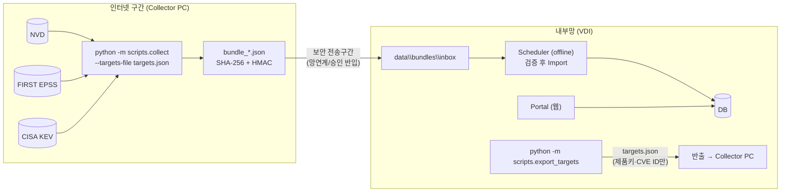

# VDI(인터넷 차단 사내망) 이전 가이드

## 1. 목표 구조



- Portal은 인터넷에 연결되지 않습니다. `COLLECTOR_MODE=offline` 이면 외부 수집 코드가 실행되지 않고 웹의 [지금 수집] 버튼도 비활성화됩니다.
- Collector와 Portal은 **같은 소스**를 사용하며, Collector는 DB 없이 동작합니다(`app/services/collector.py` 는 DB 비의존).
- Portal ↔ Collector 간 교환 데이터
  - 반출(내부 → 외부): `targets.json` — 제품 키(`a:apache:tomcat` 등)와 증분 커서, 보유 CVE ID 목록. **자산명·IP·담당자 미포함**
  - 반입(외부 → 내부): `bundle_*.json` — 공개 취약점 데이터(NVD/EPSS/KEV)의 정규화 결과 + manifest(SHA-256, 선택 HMAC)

## 2. 설치 파일 반입 (오프라인 설치)

인터넷 PC(내부 VDI와 **같은 Windows·Python 버전**)에서:

```cmd
git clone https://github.com/fionaeunji/AssetVulPortal.git
cd AssetVulPortal
py -3.12 -m pip download -r requirements.txt -d wheels
py -3.12 -m pip install pip-audit
py -3.12 -m pip_audit -r requirements.txt
certutil -hashfile wheels\<파일명> SHA256     (반입 신청서에 해시 기재 시)
```

반입 대상: 소스 폴더(`.git`, `.venv`, `data` 제외), `wheels\`, Python 설치 파일.

VDI에서:

```cmd
py -3.12 -m venv .venv
.venv\Scripts\activate.bat
pip install --no-index --find-links wheels -r requirements.txt
```

## 3. VDI 설정 (`.env`)

```
APP_ENV=prod                     # HTTPS 리버스 프록시 뒤에서 운영 시 (Secure 쿠키, HSTS)
APP_SECRET_KEY=<32자 이상 난수>
COLLECTOR_MODE=offline
BUNDLE_HMAC_KEY=<Collector PC와 동일한 32자 이상 난수>   # 반입 Bundle 위변조 검증 (필수 권장)
DATABASE_URL=sqlite:///./data/portal.db                  # 또는 PostgreSQL
```

Collector PC의 `.env` 에는 `COLLECTOR_MODE=online`, 동일한 `BUNDLE_HMAC_KEY`, 필요 시 `NVD_API_KEY`, `HTTPS_PROXY` 를 설정합니다.

```cmd
python -m scripts.init_db
python -m scripts.create_user --username admin --role admin
python -m uvicorn app.main:app --host 0.0.0.0 --port 8000        (운영은 리버스 프록시 뒤 127.0.0.1 바인딩 권장)
python -m app.scheduler                                 (별도 창 / Windows 서비스)
```

## 4. 운영 절차 (1일 2회 권장)

| 단계 | 위치 | 명령 |
|---|---|---|
| ① 수집 대상 반출 (자산 변경 시) | VDI | `python -m scripts.export_targets --out targets.json` |
| ② 수집 | Collector PC | `python -m scripts.collect --targets-file targets.json --out-dir out` (최초 대량 수집·반입 용량 제한 시 `--split`: 제품별 파일) |
| ③ 반입 | 망연계 | `out\bundle_*.json` → VDI `data\bundles\inbox\` |
| ④ Import·매핑·판정 | VDI | Scheduler(09:00/14:00)가 자동 처리 → `processed\` / `failed\` 이동. 수동: `python -m scripts.import_bundle <파일>` |
| ⑤ 확인 | VDI 웹 | 수집 메뉴 이력(source=BUNDLE), Dashboard |

- 증분 커서는 **Portal DB가 관리**합니다. Import 성공 시에만 커서가 전진하므로, Bundle이 유실·실패하면 다음 `targets.json` 이 자동으로 같은 구간을 다시 요청합니다.
- 처음 반입하는 제품은 전체 이력을 수집하므로 Bundle이 큽니다(PoC 실측: 샘플 자산 기준 약 1.6만 CVE). Bundle 1개 반입 상한은 100MB입니다. 최초 수집이나 반입 용량 제한이 있으면 `--split` 으로 제품별 Bundle을 만드세요(보유 CVE의 EPSS 갱신은 첫 파일에만 포함). 상한을 넘으면 수집 시 경고가 출력됩니다.
- 반입 파일은 Import 전에 스키마·SHA-256·HMAC 검증을 통과해야 하며, 실패 파일은 `failed\` 로 이동하고 감사로그·수집이력에 남습니다(기존 데이터 변경 없음).

## 5. PostgreSQL 전환

1. 드라이버 반입: `psycopg[binary]` wheel 추가 → `requirements.txt` 에 명시
2. `DATABASE_URL=postgresql+psycopg://vulportal:<pw>@<host>:5432/vulportal`
3. `python -m scripts.init_db` — 동일 Alembic migration + PostgreSQL용 무결성 Trigger(`app/models/guards.py`) 설치 (**PoC에서는 SQLite만 검증, PostgreSQL은 미검증 — 전환 시 테스트 필요**)
4. 권한 최소화: 애플리케이션 계정에서 `audit_logs`, `vulnerability_assessments`, `status_history` 의 `UPDATE/DELETE` 를 `REVOKE`
5. 감사로그 Hash chain은 다중 Writer 환경에서 advisory lock 적용 권장(현재 코드 주석 참고)
6. SQLite 데이터 이관이 필요하면 Bundle 재Import + 자산대장 재업로드로 재구성하는 방식을 권장(판정 이력까지 이관하려면 별도 이관 스크립트 필요 — 미구현)

## 6. 운영 전 점검 목록

| 구분 | 항목 |
|---|---|
| 인증 | 사내 SSO 연동(`app/security/auth.py` 의 `AuthProvider` 구현 교체), 초기 관리자 비밀번호 변경 |
| 전송 | 사내 인증서 HTTPS, `APP_ENV=prod` |
| 망연계 | Bundle 반입 절차 승인, `BUNDLE_HMAC_KEY` 별도 보관(양쪽 `.env` 외 저장 금지) |
| 시간 | 서버 시간 동기화(NTP) — 조치기한·스케줄·감사로그 기준 |
| 백업 | `data\portal.db`(또는 PostgreSQL), `data\bundles\processed`, `data\uploads`, `data\logs` 정기 백업 |
| 로그 | `data\logs\app.log` 순환(10MB×5), SIEM 전송 검토 |
| 파일 권한 | `data\` 폴더는 서비스 계정만 접근 |
| 정책 | `config\policy.yaml` 변경은 관리자 화면 적용(버전 변경 필수) — 변경 이력은 `policy_versions`·감사로그 |
| 취약점 | 반입 전 `pip-audit`, 정기적 의존성 갱신 |

## 7. 단일 Windows PC 모의 시험 (VDI 이전 전 사전 검증)

인터넷 PC 한 대에서 폴더 두 개로 Collector(외부망)와 Portal(VDI)을 분리해 반출 → 수집 → 반입 → Import 전 과정을 시험합니다.

| 폴더 | 역할 | `.env` |
|---|---|---|
| 기존 `AssetVulPortal` | Collector (외부망) | `COLLECTOR_MODE=online`, `BUNDLE_HMAC_KEY=<K>` |
| `C:\VDI_TEST\AssetVulPortal` | Portal (VDI) | `COLLECTOR_MODE=offline`, `BUNDLE_HMAC_KEY=<K>`(동일), 별도 `APP_SECRET_KEY` |

① Collector 폴더 — 최신화, HMAC 키 생성, 설치 파일 준비, VDI 폴더 복사
```cmd
git checkout main
git pull
python -c "import secrets; print(secrets.token_urlsafe(48))"
  → 출력값을 .env 의 BUNDLE_HMAC_KEY= 에 입력 (VDI .env 에도 같은 값)
python -m pip download -r requirements.txt -d wheels
robocopy . C:\VDI_TEST\AssetVulPortal /E /XD .git .venv data __pycache__ .pytest_cache /XF .env
```

② (선택) 인터넷 연결 해제 — VDI 단계가 인터넷 없이 되는지 확인

③ VDI 폴더 — 오프라인 설치·초기화·수집 대상 반출
```cmd
cd /d C:\VDI_TEST\AssetVulPortal
python -m venv .venv
.venv\Scripts\activate.bat
pip install --no-index --find-links wheels -r requirements.txt
copy .env.example .env
  → .env 편집: APP_SECRET_KEY=<새 난수>, COLLECTOR_MODE=offline, BUNDLE_HMAC_KEY=<K>
python -m scripts.init_db
python -m scripts.create_user --username admin --role admin
python -m scripts.import_assets sample_data\sample_assets.xlsx
python -m scripts.collect
  → "COLLECTOR_MODE=offline 에서는 외부 수집을 하지 않습니다" 확인
python -m scripts.export_targets --out C:\VDI_TEST\targets.json
```

④ Collector 폴더 (인터넷 연결 복구) — 수집 → Bundle
```cmd
python -m scripts.collect --targets-file C:\VDI_TEST\targets.json --out-dir C:\VDI_TEST\out --split
```

⑤ 반입 (인터넷 해제 가능)
```cmd
mkdir C:\VDI_TEST\AssetVulPortal\data\bundles\inbox
copy C:\VDI_TEST\out\*.json C:\VDI_TEST\AssetVulPortal\data\bundles\inbox\
cd /d C:\VDI_TEST\AssetVulPortal
.venv\Scripts\activate.bat
python -m app.scheduler --run-once
python -m uvicorn app.main:app --host 127.0.0.1 --port 8001
```

⑥ 확인 항목

| # | 확인 | 기대 결과 |
|---|---|---|
| 1 | 오프라인 설치 | `pip install --no-index` 성공 |
| 2 | 외부 수집 차단 | CLI 안내 메시지, 웹 수집 메뉴 [지금 수집] 버튼 비활성 |
| 3 | `targets.json` 내용 | 제품 키·CVE ID만 있고 자산명·IP·담당자 없음 |
| 4 | Bundle Import | `--run-once` 결과 모두 `success`, 파일은 `data\bundles\processed\` 로 이동 |
| 5 | 결과 일치 | Dashboard 건수가 온라인 폴더 결과와 같은 수준(같은 정책 버전 기준) |
| 6 | 수집 이력 | http://127.0.0.1:8001 수집 메뉴 source=`BUNDLE`, 외부 호출 목적지 없음 |
| 7 | 위변조 차단 | `processed` 의 Bundle 1개를 메모장으로 설명 한 글자 수정 → `inbox` 에 복사 → `--run-once` → `failed:BundleError`, `data\bundles\failed\` 이동, 기존 데이터 변화 없음 |
| 8 | 증분 | ③의 `export_targets` 재실행 → `last_mod_start` 가 채워짐 → ④ 재수집 시 작은 Bundle |

개발 컨테이너 모의 결과(2026-09-30, 가짜 외부 서버): 단일 Bundle과 `--split` 13개 파일 Import 결과 동일(CVE 17, 취약 자산 매핑 16, 제품 커서 13), 변조 Bundle·다른 HMAC 키 Bundle 모두 `failed` 이동, VDI 수집 이력의 외부 호출 목적지 0건.
